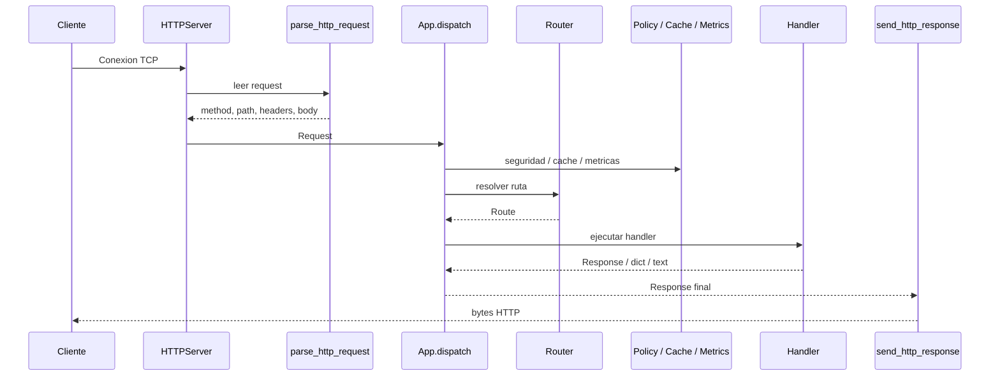
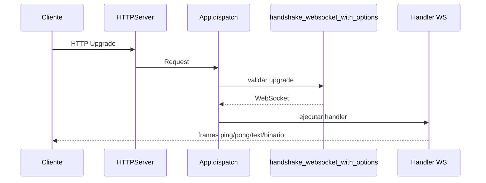
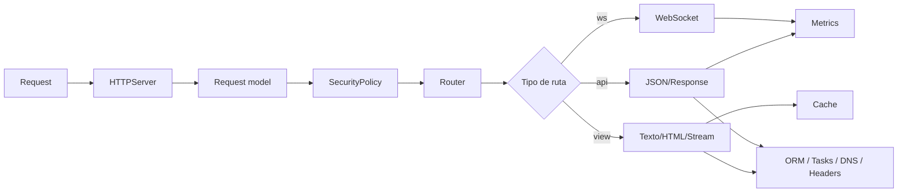
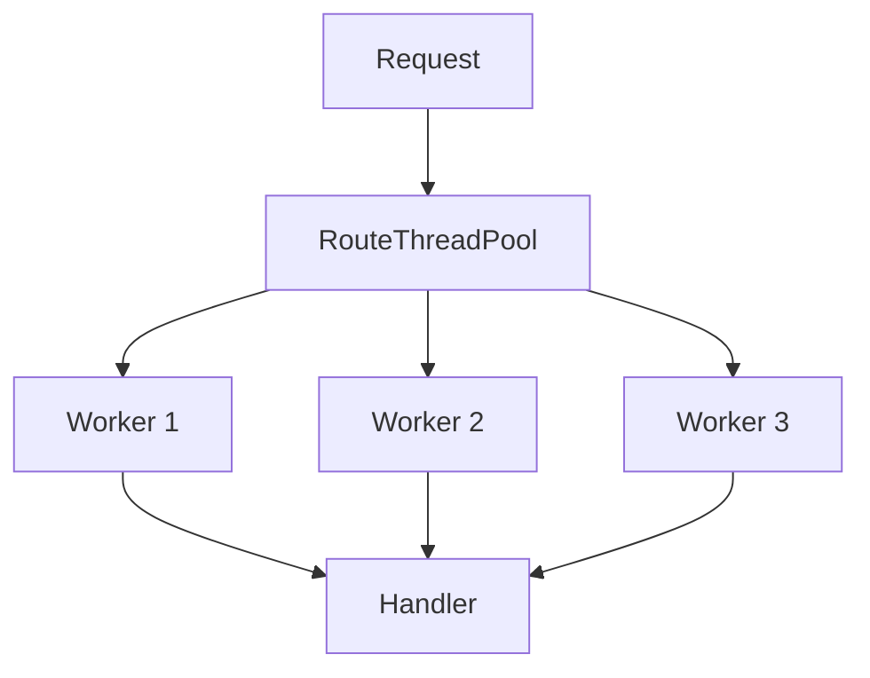
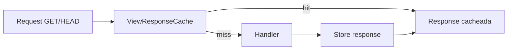
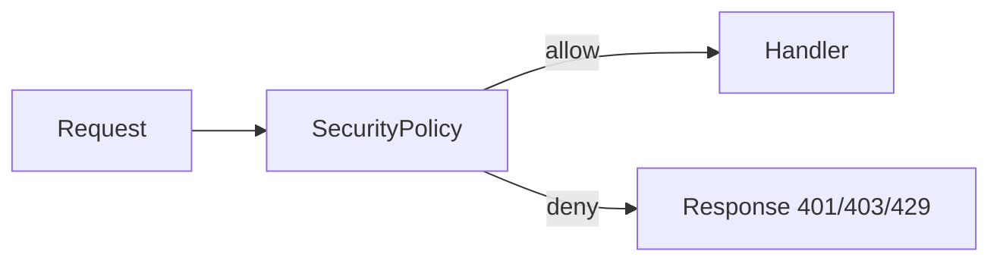

# Arquitectura

`wsbuilder` esta organizado como una base pequena de transporte y orquestacion, con modulos especializados que se conectan alrededor de `App`.

## Vista general

```mermaid
flowchart TD
    Client[Cliente HTTP o WS] --> Server[HTTPServer]
    Server --> Parser[parse_http_request]
    Parser --> App[App.dispatch]
    App --> Security[SecurityPolicy]
    App --> Router[Router]
    App --> Cache[Cache / ViewResponseCache]
    App --> Metrics[AppMetrics]
    App --> Tasks[TaskManager]
    Router --> HTTPHandler[Handler HTTP]
    Router --> WSUpgrade[Handshake WS]
    HTTPHandler --> ORM[ORM SQLite]
    HTTPHandler --> DBR[DatabaseReplicaPool]
    HTTPHandler --> DNS[LocalDNSServer]
    HTTPHandler --> Util[Cookies / Headers]
    WSUpgrade --> WS[WebSocket]
    WS --> Metrics
    ORM --> SQLite[(SQLite)]
    DBR --> SQLite
    Cache --> SQLite
    Metrics --> /api/metrics[/api/metrics]
    Tasks --> Background[Trabajo en background]
```

La idea es simple:

- `HTTPServer` solo acepta sockets, lee, valida y delega.
- `App` decide que hacer con la request.
- Los modulos alrededor de `App` agregan seguridad, cache, metricas, tareas y persistencia.

## Flujo HTTP



## Flujo WebSocket



## Modulos principales

### `wsbuilder.app`

Es la fachada de orquestacion.

Responsabilidades:

- registrar rutas HTTP con `view()` y `api()`;
- registrar rutas WebSocket con `ws()`;
- aplicar CORS;
- coordinar cache, seguridad, metricas y tareas;
- cerrar pools y recursos al apagar la aplicacion.

Punto clave:

- `App.dispatch()` es el centro de decision.
- ahi se evalua seguridad, se resuelve la ruta, se busca cache, se ejecuta el handler y se serializa la salida.

### `wsbuilder.server`

Es la capa de transporte.

Responsabilidades:

- aceptar conexiones TCP;
- aplicar timeout y limite de workers de conexion;
- leer HTTP y escribir respuestas;
- detectar upgrades WebSocket;
- cerrar todo de forma segura al terminar.

Punto clave:

- no decide negocio;
- solo transporta bytes y llama a `App`.

### `wsbuilder.http`

Es la capa de modelo y serializacion HTTP.

Responsabilidades:

- representar `Request` y `Response`;
- parsear query strings;
- leer requests HTTP desde el socket;
- serializar respuestas y streams chunked.

Interacciones:

- `Request` alimenta `App.dispatch()`;
- `Response` sale hacia `send_http_response()`;
- `Response.stream()` permite salida incremental.

### `wsbuilder.ws`

Es la capa de WebSocket.

Responsabilidades:

- detectar upgrades;
- validar handshake;
- leer y escribir frames;
- manejar ping/pong, close y errores de protocolo;
- exponer `WebSocket` y `WebSocketFrame`.

Interacciones:

- `HTTPServer` detecta upgrade;
- `App` localiza la ruta WS;
- el handler recibe el objeto `WebSocket` ya preparado.

### `wsbuilder.orm`

Es la persistencia declarativa sobre SQLite.

Responsabilidades:

- definir modelos con `Model` y campos;
- crear tablas;
- consultar con `QuerySet`;
- agrupar escritura con `Transaction`.

Interacciones:

- normalmente vive dentro de un handler HTTP;
- se apoya en `Database` o en replicas de lectura;
- funciona mejor cuando cada servicio posee su propia base.

### `wsbuilder.cache` y `wsbuilder.caches`

Son dos capas distintas:

- `cache.py` resuelve almacenamiento y expulsion en memoria;
- `caches.py` resuelve cache de respuestas HTTP y reglas declarativas.

Interacciones:

- `App.dispatch()` consulta `ViewResponseCache` antes de ejecutar una `view()`;
- la respuesta se guarda si la ruta lo permite;
- se limpian headers no reutilizables como cookies o metadatos de worker.

### `wsbuilder.security`

Es la politica de acceso.

Responsabilidades:

- ACL por ruta, metodo, IP y headers;
- listas blanca y negra;
- rate limiting;
- bloqueos temporales;
- decision de permitir o rechazar.

Interacciones:

- `HTTPServer.handle_conn()` puede aplicar seguridad antes del upgrade WS;
- `App.dispatch()` aplica seguridad al flujo HTTP general;
- la decision se convierte en `Response` lista para el cliente.

### `wsbuilder.metrics`

Es la observabilidad interna.

Responsabilidades:

- contar conexiones TCP, requests HTTP y sesiones WS;
- medir duracion y volumen de trafico;
- emitir snapshots JSON;
- emitir stream NDJSON para dashboards.

Interacciones:

- `HTTPServer` y `App.dispatch()` reportan eventos;
- `app.enable_metrics()` instala endpoints de inspeccion;
- puede mezclar informacion extra de cache, seguridad y threads.

### `wsbuilder.tasks`

Es el sistema de trabajo en background.

Responsabilidades:

- lanzar tareas con limite de concurrencia;
- controlar estados;
- manejar cancelacion y errores;
- agrupar por `group`.

Interacciones:

- `App` crea un `TaskManager` por defecto;
- los handlers lo usan para trabajo que no debe bloquear la request;
- el cierre de `App` detiene tareas pendientes.

### `wsbuilder.dns`

Es un resolver DNS local minimo.

Responsabilidades:

- responder en entornos de laboratorio o desarrollo;
- resolver `localhost`;
- registrar nombres personalizados.

Interacciones:

- suele usarse fuera del flujo HTTP, pero complementa demos o topologias locales.

### `wsbuilder.db_replicas`

Es la capa de lectura optimizada sobre SQLite.

Responsabilidades:

- separar escrituras de lecturas;
- usar replicas para reducir contencion;
- ajustar pragmas y parametros de rendimiento.

Interacciones:

- encaja bien en servicios con muchas lecturas;
- normalmente se consume desde handlers HTTP o tareas.

### `wsbuilder.cookies` y `wsbuilder.headers`

Son utilidades de protocolo.

Responsabilidades:

- construir y leer cookies;
- normalizar nombres de header;
- consultar y setear cabeceras de forma consistente.

Interacciones:

- `App.dispatch()` las usa para CORS, cookies de afinidad y respuestas de worker.

### `wsbuilder.predicts`

Es una utilidad matematica exportada para casos especificos.

Responsabilidades:

- encapsular una logica numerica sencilla reutilizable.

Interacciones:

- no forma parte del camino HTTP principal;
- se usa solo si tu app necesita esa utilidad.

## Como interactuan entre si



La secuencia real cambia segun la ruta:

- en `api()`, el handler suele devolver `dict`, `list` o `Response.json()`;
- en `view()`, el handler puede devolver texto, HTML o un stream;
- en `ws()`, el handler vive dentro de un canal persistente;
- en rutas con cache, `ViewResponseCache` puede responder antes de ejecutar el handler;
- en rutas protegidas, `SecurityPolicy` puede cortar el flujo antes de llegar al negocio.

## Piezas de orquestacion

### Rutas `view()` con workers

`view()` puede usar un pool dedicado de threads por ruta.



Esto sirve cuando quieres:

- aislar carga pesada de una ruta;
- limitar concurrencia por endpoint;
- devolver metadatos de worker en headers o cookie.

### Cache declarativa

La cache de respuestas no reemplaza al ORM ni al almacenamiento de dominio.



### Seguridad antes del negocio



## Cierre y ciclo de vida

Cuando la aplicacion termina:

- `HTTPServer` cierra el socket;
- `App.close()` detiene tareas;
- `App.close()` libera caches;
- los pools de workers de las rutas se cierran;
- el sistema vuelve a un estado consistente.

## Resumen operativo

- `server` mueve bytes.
- `http` modela request y response.
- `ws` maneja upgrade y frames.
- `app` decide y coordina.
- `orm` guarda estado.
- `cache` acelera lecturas.
- `security` filtra acceso.
- `metrics` observa.
- `tasks` desacopla trabajo lento.
- `dns` ayuda en entornos locales.
- `db_replicas` optimiza lecturas.
- `cookies` y `headers` simplifican protocolo.

## Cuando este diseño funciona mejor

- APIs pequenas y medianas.
- Servicios con una frontera clara de responsabilidad.
- Aplicaciones que necesitan HTTP, WebSocket y utilidades de infraestructura sin depender de un framework grande.
- Proyectos donde la trazabilidad del flujo importa mas que una abstraccion opaca.
