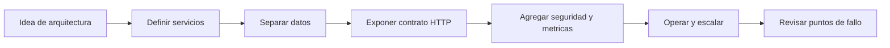

# Ayuda

Esta seccion agrupa guias practicas para usar `wsbuilder` en escenarios reales, con foco en decisiones de arquitectura y patrones de uso.

## Que encontraras aqui

<strong>Microservicios</strong>Como dividir responsabilidades, aislar datos y exponer salud, metricas y contratos.

<strong>Operacion</strong>Recomendaciones para cache, seguridad, tareas y observabilidad por servicio.

<strong>Integracion</strong>Como conectar servicios entre si sin mezclar persistencia ni estado local.

## Mapa de ayuda

## Rutas recomendadas

1. Empieza por [Microservicios](microservices.md) si estas diseñando una plataforma distribuida.
2. Lee [Arquitectura](../architecture.md) para entender como se conecta cada modulo interno.
3. Consulta [Referencia](../reference/index.md) cuando necesites la API exacta de una clase o helper.

## Criterio rapido

- Usa `App` como limite del servicio.
- Usa `Database` por servicio, no una base compartida para todos.
- Usa `TaskManager` para trabajo local, no para coordinar procesos distribuidos.
- Usa `AppMetrics` y `SecurityPolicy` en cada servicio expuesto.
