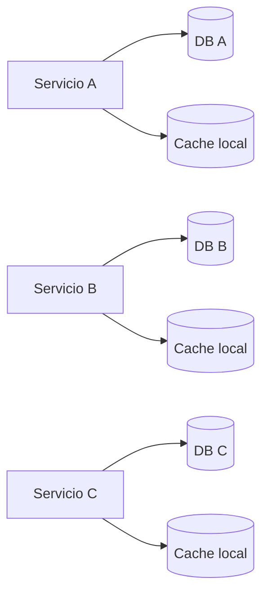
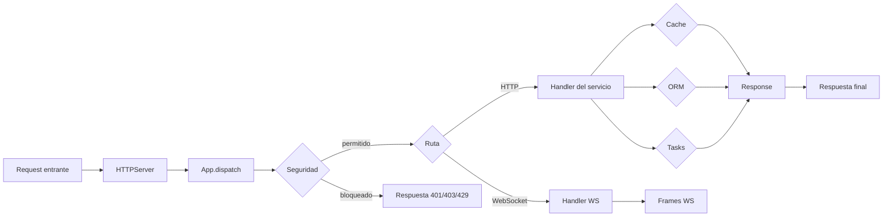

# Microservicios

`wsbuilder` puede funcionar bien como base de cada servicio individual en una arquitectura distribuida, siempre que respetes una regla simple: cada servicio debe ser autonomo en su ciclo de vida, datos y observabilidad.

## Modelo recomendado

```mermaid
flowchart TD
    Client[Cliente web o mobile] --> Gateway[API Gateway / LB]
    Gateway --> Auth[Servicio de autenticacion]
    Gateway --> Users[Servicio de usuarios]
    Gateway --> Orders[Servicio de pedidos]
    Gateway --> Billing[Servicio de pagos]

    Users --> UsersDB[(SQLite propia)]
    Orders --> OrdersDB[(SQLite propia)]
    Billing --> BillingDB[(SQLite propia)]

    Users --> UsersMetrics[/api/metrics]
    Orders --> OrdersMetrics[/api/metrics]
    Billing --> BillingMetrics[/api/metrics]

    Users --> UsersJobs[TaskManager local]
    Orders --> OrdersJobs[TaskManager local]
    Billing --> BillingJobs[TaskManager local]

    Gateway -->|HTTP JSON| Users
    Gateway -->|HTTP JSON| Orders
    Gateway -->|HTTP JSON| Billing
```

## Principios

### 1. Un servicio, un contrato

Cada servicio debe exponer rutas claras, por ejemplo:

- `GET /health` para salud basica.
- `GET /ready` para disponibilidad real.
- `GET /api/metrics` para observabilidad.
- `POST /api/...` para operaciones de negocio.

El contrato debe ser estable, versionado y predecible. Si cambias una respuesta, hazlo con versionado de rutas o con compatibilidad hacia atras.

### 2. Un servicio, sus datos

No compartas una misma base de datos para todos los servicios. Con `wsbuilder`, lo normal es:

- una instancia `Database` por servicio;
- modelos `Model` definidos dentro del dominio de ese servicio;
- replicas de lectura solo si el servicio lo necesita;
- cache local para lecturas repetitivas o respuestas calculadas.



### 3. Seguridad en el borde de cada servicio

No asumas que el gateway resolvera todo. Cada servicio debe validar:

- origen y autenticacion;
- ACL por ruta o metodo;
- rate limiting;
- TLS en rutas sensibles;
- listas blancas o negras si aplica.

`SecurityPolicy` y `install_security()` te permiten aplicar esa capa de forma consistente.

### 4. Observabilidad por servicio

Cada servicio debe poder responder a estas preguntas:

- cuanto trafico recibe;
- que rutas concentran la carga;
- cuantas conexiones activas tiene;
- cuantas respuestas fallan;
- cuanto tarda en promedio.

`app.enable_metrics()` expone una vista util para paneles o scraping.

## Como encaja `wsbuilder`



## Patrón por tipo de servicio

### Servicio de dominio

Usalo para reglas de negocio, datos y operaciones internas.

- `App` para enrutar.
- `Database` y `Model` para persistencia.
- `TaskManager` para tareas locales pesadas.
- `SQLiteMemoryCache` o `ViewResponseCache` para lecturas repetidas.

### Servicio de borde

Usalo como capa de entrada o gateway.

- `App` para agrupar endpoints.
- `SecurityPolicy` para limites y control de acceso.
- `AppMetrics` para monitoreo.
- `Response` y utilidades HTTP para normalizar salida.

### Servicio en tiempo real

Usalo si necesitas eventos o canales persistentes.

- `@app.ws(...)` para conversaciones largas.
- `keepalive_interval` y `pong_timeout` para controlar vida util.
- `AppMetrics` para contar conexiones y mensajes.

## Ejemplo de division practica

1. `auth-service`: login, refresh tokens y permisos.
2. `users-service`: perfil, preferencias y metadatos.
3. `orders-service`: creacion, consulta y estado de pedidos.
4. `billing-service`: cobros, conciliacion y reintentos.
5. `gateway`: una sola entrada publica, sin logica de dominio pesada.

## Reglas de integracion entre servicios

- Usa HTTP/JSON para comandos simples.
- Usa eventos o colas externas si necesitas desacoplar procesamiento.
- Mantener `TaskManager` dentro del servicio, no como orquestador global.
- No dependas de cookies de afinidad entre servicios distintos.
- Si un servicio falla, los demas deben degradar con respuestas claras.

## Checklist rapido

- [ ] Cada servicio tiene su propio `App`.
- [ ] Cada servicio tiene su propia base de datos.
- [ ] Cada servicio expone `health`, `ready` y `metrics`.
- [ ] La seguridad se aplica en cada borde.
- [ ] Las tareas largas se ejecutan localmente.
- [ ] Los errores devuelven respuestas consistentes y versionadas.

## Ejemplo minimo

```python
from wsbuilder import App, Database, Model, IntegerField, TextField, SecurityPolicy, install_security

app = App(cors_allow_origin="https://tu-gateway.com")
install_security(app, SecurityPolicy(rate_limit_requests=120, rate_limit_window_seconds=60))

class Customer(Model):
    id = IntegerField(primary_key=True, auto_increment=True)
    name = TextField(null=False)

db = Database("customers.db")
Customer.create_table(db)

@app.api("/health")
def health(_request):
    return {"ok": True, "service": "customers"}

@app.api("/api/customers")
def list_customers(_request):
    return {"items": [row.to_dict() for row in Customer.objects(db).limit(50)]}
```

## Que evitar

- Compartir modelos y tablas entre servicios.
- Hacer llamadas circulares entre servicios.
- Usar un solo cache global para todo el sistema sin namespaces.
- Mezclar procesos de negocio con tareas de infraestructura en el mismo handler.
- Exponer informacion interna sin filtros en endpoints publicos.
