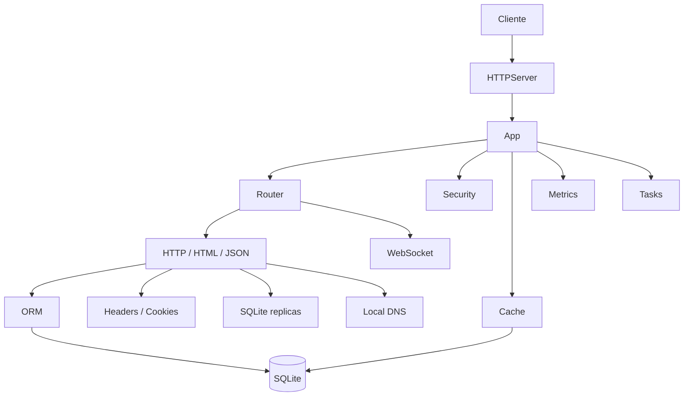
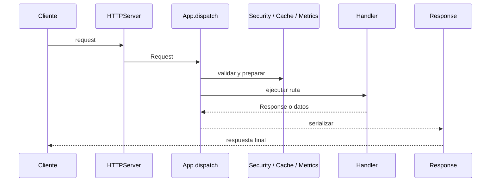

<div class="hero">

# wsbuilder

Libreria Python para construir servidores HTTP, WebSocket y utilidades de infraestructura con una API pequena y composable.

</div>

## Mapa de plataforma



## Bloques principales

<div class="cards">
<div class="card"><strong>HTTP</strong>Router, request/response, stream chunked y parseo de query string.</div>
<div class="card"><strong>WebSocket</strong>Handshake, frames, control de ping/pong y errores de protocolo.</div>
<div class="card"><strong>Persistencia</strong>Modelos SQLite, `QuerySet`, transacciones y replicas de lectura.</div>
<div class="card"><strong>Infra</strong>Cache, seguridad, metricas, tareas, DNS local y utilidades de protocolo.</div>
</div>

## Flujo mental



## Casos de uso principales

<div class="cards">
<div class="card"><strong>APIs pequenas</strong>Construye endpoints JSON y vistas HTML sin arrastrar un framework grande.</div>
<div class="card"><strong>Tiempo real</strong>Usa WebSocket para chat, eventos y estados en vivo.</div>
<div class="card"><strong>SQLite serio</strong>Modela datos, transacciones y lecturas optimizadas con una capa consistente.</div>
<div class="card"><strong>Control interno</strong>Agrega cache, seguridad, metricas y tareas sin salir de la misma API.</div>
</div>

## Por que esta libreria es fuerte

- Tiene fronteras claras entre transporte, negocio y observabilidad.
- Exige poco para empezar y permite crecer por modulos.
- Usa componentes simples que puedes leer, depurar y extender sin magia opaca.
- Expone helpers de bajo nivel para cuando necesitas controlar el protocolo, no solo abstraerlo.
- Encaja bien como base de servicios pequenos o como pieza interna de una arquitectura mayor.

## Vista rapida

```python
from wsbuilder import App, Response, Database, Model, IntegerField, TextField

app = App(cors_allow_origin="*")
app.enable_metrics()

class User(Model):
    id = IntegerField(primary_key=True, auto_increment=True)
    username = TextField(unique=True, index=True, null=False)
    email = TextField(null=False)

db = Database("app.db")
User.create_table(db)

@app.view("/")
def home(_request):
    return Response.html("<h1>wsbuilder</h1>")

@app.api("/api/health")
def health(_request):
    return {"ok": True}

app.run("0.0.0.0", 8765)
```

## Como leer esta documentacion

1. Empieza por [Empezar](getting-started.md) si quieres levantar algo rapido.
2. Sigue con [Arquitectura](architecture.md) para entender el flujo interno.
3. Abre [Ayuda](help/index.md) si estas pensando en Microservicios o topologias distribuidas.
4. Usa [Referencia](reference/index.md) para ir directo a una clase, modulo o helper.

## Contribucion y soporte

- Trabaja en ramas `feat/<nombre>` o `fix/<nombre>` creadas desde `main`.
- Abre PRs hacia `main` con cambios pequenos y faciles de revisar.
- Si detectas una vulnerabilidad, usa el canal privado en vez de una issue publica.
- Soporte opcional por BTC: `bc1q3lhxpr9yantvefmvhpd2h4lu0ykf3t45zvuve2`
