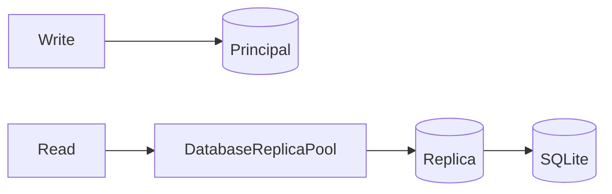

# Avanzado



Esta pagina cubre piezas utilitarias que no forman parte del flujo basico HTTP, pero si de la API publica.

## Replicas SQLite

- `SQLite3OptimizationConfig`
- `DatabaseReplica`
- `DatabaseReplicaPool`
- `OptimizedDatabase`

Usalas cuando quieras separar lecturas y escribir sobre una base principal.

## Flujo de replicas

```text
write -> base principal
read  -> pool de replicas
sync  -> checkpoint / vacuum / pragmas
```

## Casos de uso

- Servicios con muchas lecturas y pocas escrituras.
- Bases SQLite en procesos concurrentes.
- Ajuste fino de pragmas y latencia de consulta.

## Predictor

- `Predictor`

Es una utilidad matematica interna exportada por el paquete. Si vas a exponerla en tu propia API, documenta el contrato de entrada y salida en tu proyecto porque no es un flujo HTTP de primera linea.

## Cuando usarlo

- Cuando necesites una capa de lectura optimizada sin salir de SQLite.
- Cuando el control de pragmas y replicas sea mas importante que la abstraccion ORM.

## Rol del modulo

- Resolver escenarios de lectura intensiva sin cambiar de base de datos.
- Dar control fino sobre optimizacion SQLite.
- Mantener utilidades avanzadas fuera del flujo comun de la app.
