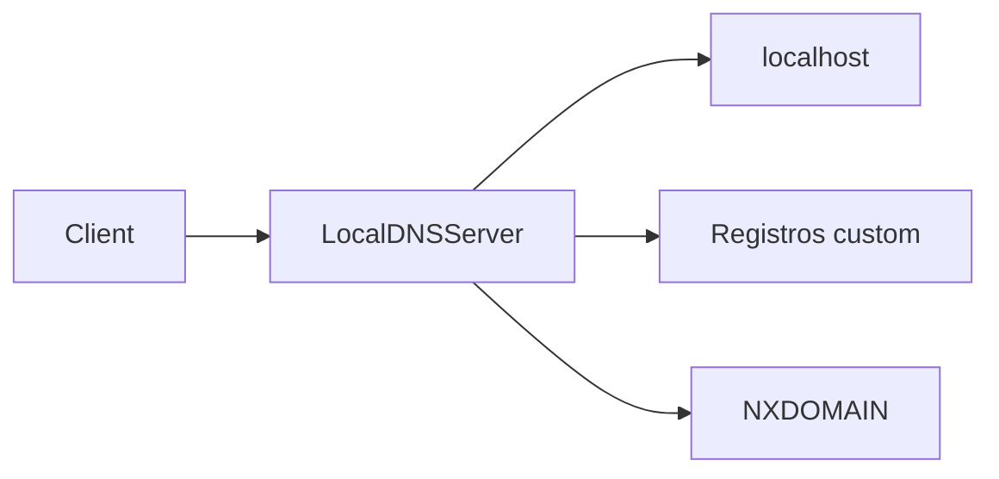

# DNS local



`LocalDNSServer` expone un servidor DNS UDP minimo pensado para entornos locales.

## Valores por defecto

- `host="127.0.0.1"`
- `port=5533`
- `ttl=60`

## Ejemplo

```python
from wsbuilder import LocalDNSServer

dns = LocalDNSServer()
dns.start()
```

## Comportamiento

- Responde `A` y `AAAA` para `localhost`.
- Acepta registros personalizados.
- Devuelve `NXDOMAIN` para nombres desconocidos.

## Casos de uso

- Resolver nombres locales en desarrollo.
- Simular dominios de prueba sin infraestructura externa.
- Montar un resolver pequeno para demos o laboratorios.

## Rol del modulo

- Cerrar el circuito de una demo local sin depender de DNS externo.
- Ayudar en pruebas de integracion y laboratorios.
- Mantener una pieza de infraestructura simple y portable.
