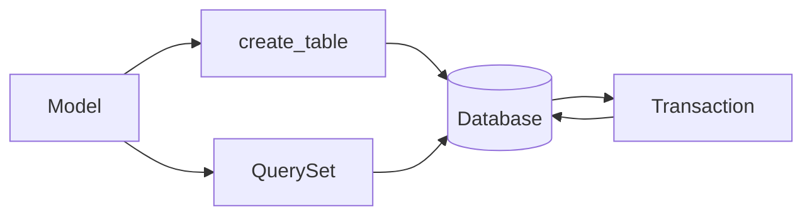

# ORM



El ORM de `wsbuilder` esta pensado para SQLite y modelos declarativos simples, con un coste de aprendizaje bajo.

## Tipos principales

- `Database`
- `Model`
- `QuerySet`
- `Transaction`
- `Field`
- `IntegerField`
- `TextField`
- `RealField`
- `BlobField`
- `BooleanField`
- `DateTimeField`
- `JSONField`
- `SQL`

## Ejemplo

```python
from wsbuilder import Database, IntegerField, Model, TextField

class User(Model):
    id = IntegerField(primary_key=True, auto_increment=True)
    username = TextField(unique=True, index=True, null=False)
    email = TextField(null=False)

db = Database("app.db")
User.create_table(db)

u = User(username="alice", email="alice@example.com")
u.save(db)
```

## Flujo de trabajo

1. Defines un `Model`.
2. Creas o abres una `Database`.
3. Llamas `create_table()` o `create_tables()`.
4. Consultas con `objects(db)` y `QuerySet`.
5. Escribes con `save()`, `update()` o `delete()`.

## QuerySet

Soporta:

- `filter()`
- `exclude()`
- `order_by()`
- `limit()`
- `offset()`
- `paginate()`
- `values()`
- `count()`
- `exists()`
- `update()`
- `delete()`
- `create()`

## Utilidades SQL

- `validate_identifier(name)`
- `quote_identifier(name)`
- `create_tables(db, *models)`
- `drop_tables(db, *models)`

## Buenas practicas

- Usa nombres de columnas estables y validables.
- No construyas SQL dinamico sin pasar por `validate_identifier()`.
- Usa `Transaction` para agrupar escrituras cuando necesites atomicidad.
- Manten los modelos pequenos y expresivos.

## Casos de uso

- CRUD local con SQLite.
- Paneles admin simples sin ORM pesado.
- Servicios embebidos con persistencia determinista.
- Lecturas razonadas con filtros por campo y operador.

## Rol del modulo

- Traduce modelos declarativos a tablas SQLite.
- Aporta consultas expresivas sin perder control del SQL final.
- Funciona bien en servicios donde la base de datos vive junto al servicio.
