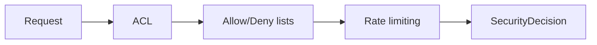

# Seguridad



El motor de seguridad se centra en tres capas:

1. ACL por ruta, metodo, IP y headers.
2. Lista blanca / lista negra.
3. Bloqueos temporales por rate limiting o comportamiento sospechoso.

## Clases y funciones

- `SecurityPolicy`
- `ACLRule`
- `SecurityDecision`
- `install_security(app, policy=None)`

## Ejemplo

```python
from wsbuilder import App, SecurityPolicy, install_security

app = App()
policy = SecurityPolicy(rate_limit_requests=120, rate_limit_window_seconds=60)
install_security(app, policy)
```

## Como decide

1. Resuelve la IP del cliente.
2. Evalua ACL y listas blanca/negra.
3. Aplica limites de tasa y ventanas temporales.
4. Devuelve una decision que puede convertirse en respuesta HTTP.

## Capacidades

- ACL por `path`, `path_prefix`, `path_regex`.
- Filtros por `methods`.
- Restriccion por `ip_cidrs`.
- Requerir o prohibir TLS por ruta.
- Reglas por headers exactos o regex.
- Bloqueo temporal con `Retry-After` cuando corresponde.

## Casos de uso

- Restringir endpoints de administracion.
- Proteger APIs publicas con limites de tasa.
- Bloquear bots o clientes abusivos.
- Exigir TLS en rutas sensibles.

## Rol del modulo

- Cortar acceso no autorizado antes de llegar al handler.
- Convertir reglas de acceso en respuestas HTTP concretas.
- Registrar senales de abuso para bloquear o limitar trafico.
