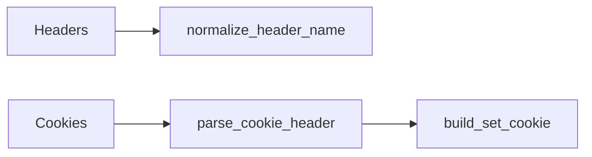

# Utilidades HTTP



Esta pagina agrupa helpers pequenos de cabeceras y cookies.

## Headers

- `normalize_header_name(name)`
- `get_header(headers, name, default="")`
- `has_header(headers, name)`
- `set_header(headers, name, value, overwrite=True)`

Usalos cuando necesites manipular cabeceras sin depender de un framework completo.

## Cookies

- `parse_cookie_header(cookie_header)`
- `get_cookie(headers, name, default="")`
- `build_set_cookie(...)`

## Ejemplo

```python
from wsbuilder import get_header, build_set_cookie

content_type = get_header(headers, "content-type")
cookie = build_set_cookie("session", "abc123", httponly=True, samesite="Lax")
```

## Casos de uso

- Autenticacion basada en cookies.
- Normalizacion de cabeceras entrantes.
- Respuestas con `Set-Cookie` controlado.

## Rol del modulo

- Evitar repetir logica de protocolo en cada handler.
- Mantener lectura y escritura de cabeceras consistente.
- Facilitar autenticacion y afinidad sin acoplar el negocio.
