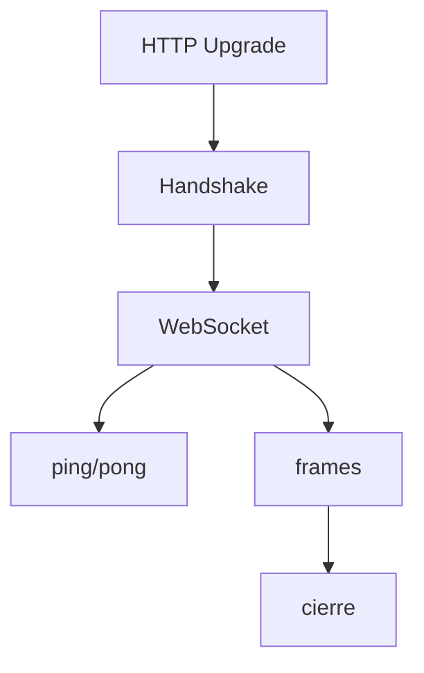

# WebSocket



`wsbuilder` implementa handshake y framing WebSocket sin dependencias externas.

## Handshake

Funciones utiles:

- `is_ws_request(headers)`
- `handshake_websocket(conn, addr, headers)`
- `handshake_websocket_with_options(...)`

El handshake valida:

- `Sec-WebSocket-Key`
- `Connection: Upgrade`
- `Upgrade: websocket`
- `Sec-WebSocket-Version: 13`

## Flujo de vida

```text
socket TCP
  -> request HTTP
  -> upgrade WebSocket
  -> bucle de frames
  -> ping/pong
  -> close
```

## WebSocket

`WebSocket` expone operaciones de alto nivel y callbacks de ciclo de vida.

Opciones soportadas:

- `idle_timeout`
- `keepalive_interval`
- `pong_timeout`
- `auto_pong`
- `on_close`
- `on_error`
- `on_timeout`
- `io_poll_interval`
- `ping_payload`
- `subprotocols`

Ejemplo minimo:

```python
from wsbuilder import App, parse_close_payload

app = App()

@app.ws("/ws/")
def ws_handler(ws, _request):
    while True:
        frame = ws.recv_frame()
        if frame.opcode == 0x8:
            code, reason = parse_close_payload(frame.payload)
            ws.close(code or 1000, reason or "")
            break
        if frame.opcode == 0x9:
            ws.send_pong(frame.payload)
            continue
        if frame.opcode == 0x1:
            ws.send_text(frame.payload.decode("utf-8", errors="ignore"))
```

## Casos de uso

- Chat en tiempo real.
- Notificaciones push desde el servidor.
- Consolas remotas o paneles de operacion.
- Telemetria con actualizaciones continuas.

## Errores del protocolo

- `WebSocketProtocolError`
- `WebSocketReadError`
- `WebSocketReadTimeoutError`
- `WebSocketConnectionClosedError`

## Frames

`WebSocketFrame` es una dataclass con:

- `fin`
- `opcode`
- `payload`
- `masked`
- `mask`

## Helpers utiles

- `is_ws_request(headers)` para detectar upgrade.
- `handshake_websocket(...)` para hacer el upgrade basico.
- `handshake_websocket_with_options(...)` para controlar subprotocolos y timeouts.
- `make_ws_frame_bytes(...)` para generar frames manualmente.

## Rol del modulo

- Convierte una conexion HTTP en un canal persistente.
- Expone control fino de frames y estados del protocolo.
- Permite construir tiempo real sin depender de un stack externo pesado.
